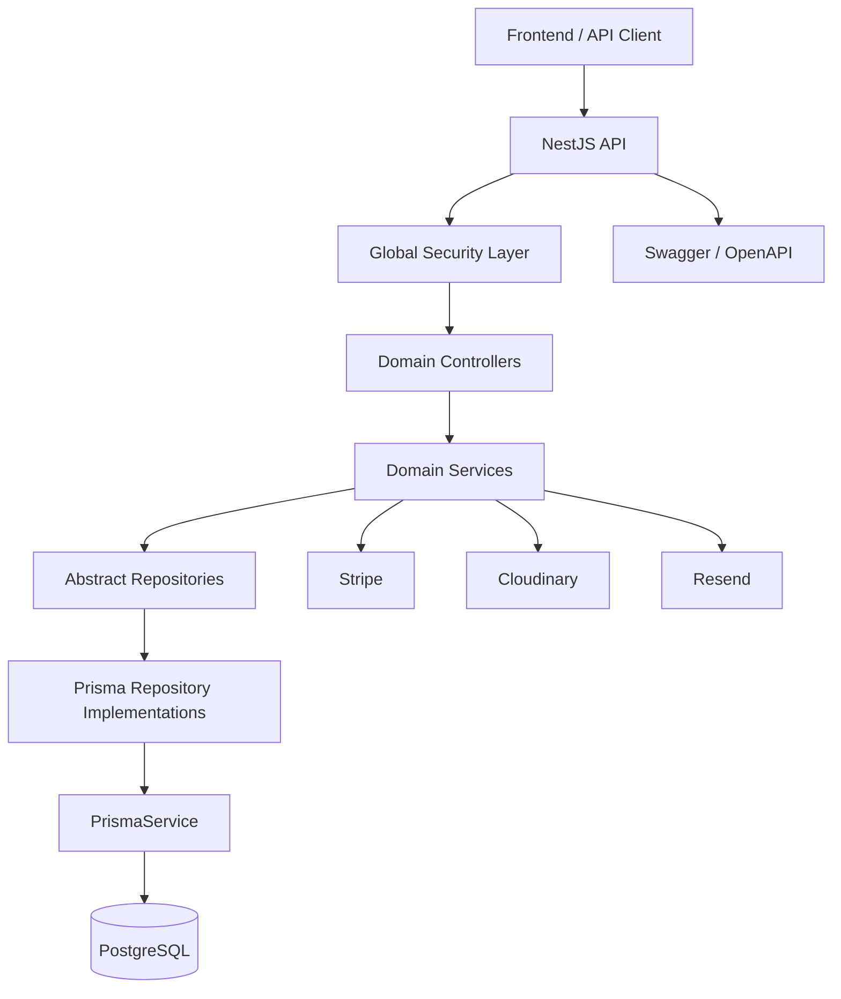
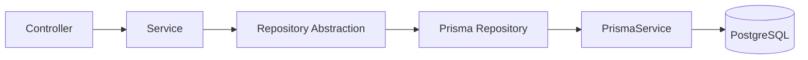
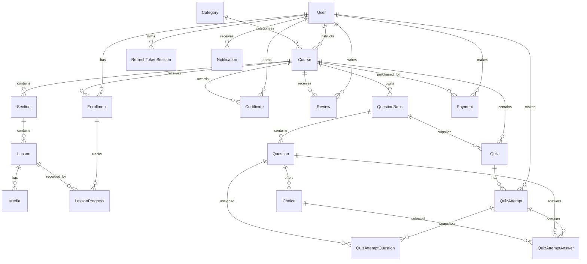
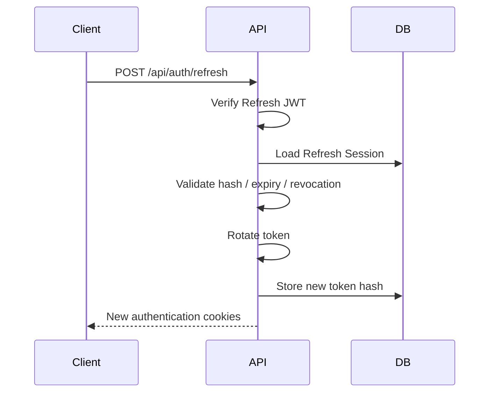
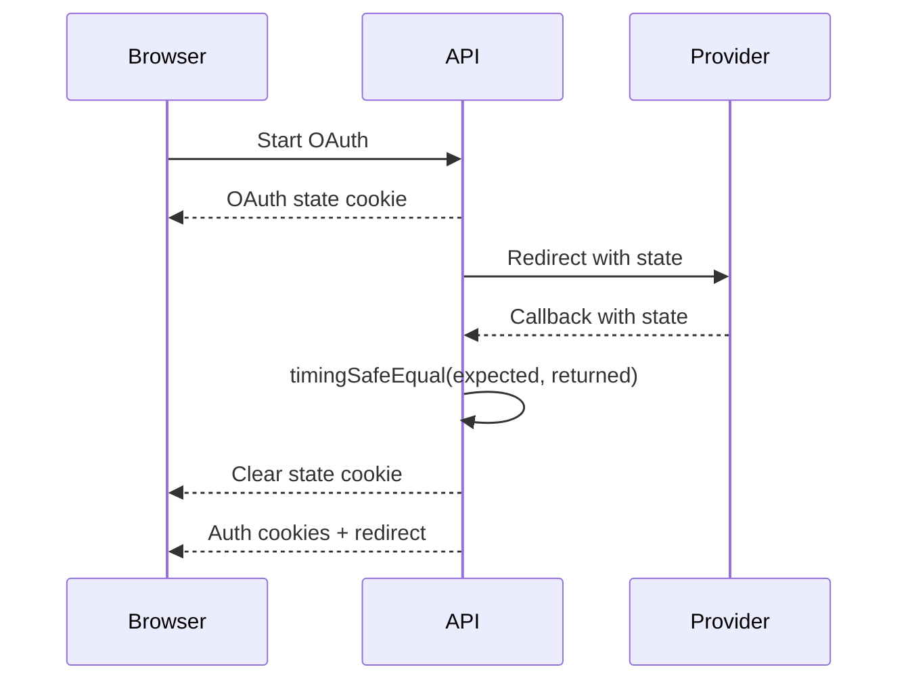
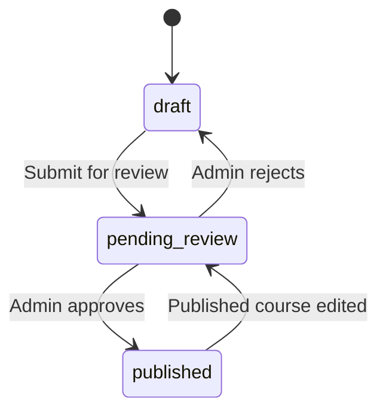
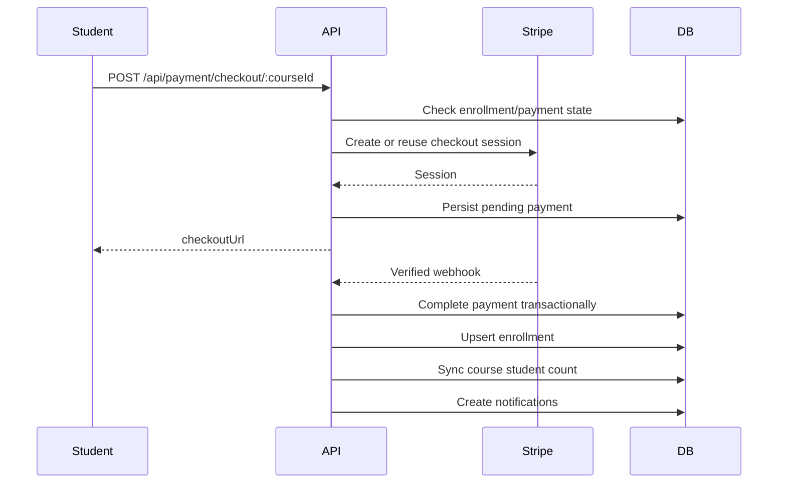

<div align="center">

# 🧠 LMS Backend — NestJS API

### A production-oriented backend for a full Learning Management System

**NestJS 11 · TypeScript · PostgreSQL · Prisma 7.8 · Passport · JWT · OAuth · Stripe · Cloudinary · Resend · Jest**

</div>

---

## 📌 Overview

This repository contains the backend API for a full Learning Management System supporting **students, instructors, and administrators**.

The backend is built as a modular NestJS monolith with:

- feature-based modules
- clear controller/service/repository boundaries
- Prisma-backed repositories
- PostgreSQL persistence
- cookie-based authentication
- refresh-token sessions
- CSRF protection
- Google and GitHub OAuth
- Stripe Checkout and verified webhooks
- Cloudinary media storage
- Resend email delivery
- course approval workflows
- persisted learning progress
- timed quiz attempts
- transactional certificate issuance
- reviews and notifications

The main architectural goal is to keep business logic independent from direct ORM usage:

```text
HTTP Request
    ↓
Controller
    ↓
Service
    ↓
Abstract Repository
    ↓
Prisma Repository
    ↓
PrismaService
    ↓
PostgreSQL
```

---

# 🧱 System Architecture



The application is a modular NestJS monolith. `AppModule` loads global configuration, scheduling support, Prisma infrastructure, and the feature modules.

---

# 🗂️ Source Architecture

```text
src/
├── app.controller.ts
├── app.service.ts
├── app.module.ts
├── main.ts
│
├── auth/
│   ├── auth.controller.ts
│   ├── auth.service.ts
│   ├── auth.repo.ts
│   ├── auth-prisma.repo.ts
│   ├── auth.module.ts
│   ├── auth-cookie.options.ts
│   ├── jwt.strategy.ts
│   ├── oauth-state.middleware.ts
│   ├── dto/
│   ├── decorator/
│   ├── guard/
│   ├── strategies/
│   └── types/
│
├── users/
├── category/
├── course/
├── section/
├── lesson/
├── media/
├── quiz/
├── question-bank/
├── question/
├── choice/
├── quiz-attempt/
├── payment/
├── enrollment/
├── certificate/
├── notification/
├── review/
├── mail/
├── cloudinary/
│
├── infrastructure/
│   └── prisma/
│
├── common/
│   ├── prisma/
│   └── security/
│       └── csrf/
│
├── types/
└── utils/
```

Every main persistence-backed domain uses the same boundary:

```text
*.controller.ts
      ↓
*.service.ts
      ↓
*.repo.ts
      ↓
*-prisma.repo.ts
```

`mail` and `cloudinary` are provider services rather than repository-backed domains.

---

# 🧩 Repository Pattern

Repository contracts are implemented as **abstract TypeScript classes** so they can act as runtime NestJS injection tokens.

Example:

```ts
constructor(
  private readonly courseRepository: CourseRepository,
) {}
```

The module binds the abstraction to Prisma:

```ts
{
  provide: CourseRepository,
  useClass: PrismaCourseRepository,
}
```

This keeps service logic independent from Prisma-specific queries.



Complex database-atomic behavior remains in repository implementations, including:

- payment completion and enrollment creation
- lesson-progress synchronization
- quiz-attempt creation
- quiz submission and scoring

---

# 🗃️ Database Design

The current schema uses:

- PostgreSQL
- CUID primary keys
- explicit composite uniqueness
- domain indexes
- cascading deletes for dependent educational records
- transactional persistence for critical flows

---

## 🧬 Entity Relationship Diagram



---

## 📚 Main Models

### `User`

Stores local/OAuth identity, email verification state, password reset state, avatar, provider information, role, sessions, and LMS relationships.

Important constraints:

```text
UNIQUE email
UNIQUE verification token
UNIQUE reset token
UNIQUE (provider, providerId)
```

### `RefreshTokenSession`

Database-backed refresh sessions with user, token hash, user agent, IP, expiry, and revocation state.

### `Course`

Tracks category, instructor, price, level, status, rating aggregate, student count, duration, lesson count, and publication metadata.

### `Section` → `Lesson` → `Media`

```text
Course
  └── Section
       └── Lesson
            └── Media
```

Ordering constraints:

```text
UNIQUE (courseId, order)
UNIQUE (sectionId, order)
```

### `Enrollment`

Stores student, course, progress, completion state, and persisted learning position.

```text
UNIQUE (studentId, courseId)
```

### `LessonProgress`

```text
UNIQUE (enrollmentId, lessonId)
```

### `QuestionBank` / `Question` / `Choice`

```text
Course
  └── QuestionBank
       └── Question
            └── Choice
```

### `Quiz`

References a course and question bank and stores question count, total mark, passing percentage, maximum attempts, and duration.

### `QuizAttempt`

Stores student, quiz, attempt number, status, score, earned mark, counts, and timing data.

```text
UNIQUE (studentId, quizId, attemptNumber)
```

### `QuizAttemptQuestion`

Snapshots questions selected for an attempt.

```text
UNIQUE (attemptId, questionId)
UNIQUE (attemptId, order)
```

### `QuizAttemptAnswer`

```text
UNIQUE (attemptId, questionId)
```

### `Certificate`

```text
UNIQUE certificateNumber
UNIQUE (studentId, courseId)
```

### `Review`

```text
UNIQUE (studentId, courseId)
```

### `Payment`

Stripe-linked payment persistence with unique Stripe IDs. Multiple payment attempts for the same student/course are allowed.

---

# 🧾 Prisma Enums

```text
UserRole
├── student
├── instructor
└── admin

AuthProvider
├── local
├── google
├── facebook
└── github

CourseLevel
├── beginner
├── intermediate
└── advanced

CourseStatus
├── draft
├── published
├── archived
└── pending_review

MediaType
├── video
├── audio
├── document
└── url

NotificationType
├── info
├── warning
├── success
└── error

PaymentStatus
├── pending
├── completed
├── expired
├── failed
└── refunded

QuizAttemptStatus
├── in_progress
└── submitted

LearningItemType
├── lesson
└── quiz
```

> `facebook` exists as an enum value but no Facebook OAuth strategy is currently implemented. `refunded` exists as a payment state but no refund workflow is currently implemented.

---

# 🔐 Authentication Architecture

Supported flows:

- local registration
- email verification
- local login
- access tokens
- refresh tokens
- database-backed refresh sessions
- token rotation
- logout revocation
- password reset
- Google OAuth
- GitHub OAuth

## Registration

Registration normalizes email, rejects duplicates, hashes passwords with bcrypt, creates the user, generates a verification token, stores only its SHA-256 hash, applies a 15-minute expiry, and emails the raw token through Resend.

## Local Login

Successful login:

```text
Create Refresh Session
        ↓
Sign Access JWT
        ↓
Sign Refresh JWT
        ↓
Hash Refresh JWT
        ↓
Persist Refresh Hash
        ↓
Set Auth Cookies
```

## Token Lifetime

```text
Access Token  → 15 minutes
Refresh Token → 7 days
```

Auth cookies:

```text
access_token
refresh_token
```

Production:

```text
httpOnly = true
secure = true
sameSite = none
path = /
```

Development:

```text
httpOnly = true
secure = false
sameSite = lax
path = /
```

## Refresh Rotation



A refresh validates signature, session ownership, revocation, expiry, stored hash, and bcrypt token match. Hash mismatch revokes the session. Password reset revokes all refresh sessions.

---

# 🌐 OAuth

Google and GitHub authentication use Passport strategies.

OAuth-created users store provider identity, verified email state, avatar, and a nullable password.

Existing accounts are not silently linked only by matching email.

## OAuth State Protection

OAuth state uses:

- 24 random bytes
- hexadecimal encoding
- provider-specific HTTP-only cookie
- five-minute lifetime
- timing-safe comparison



---

# 🛡️ CSRF Protection

Library:

```text
csrf-csrf 4.0.3
```

Pattern:

```text
Double Submit Cookie
+
Separate Random Session Identifier
```

Development cookies:

```text
lms.csrf-id
lms.csrf-token
```

Production cookies:

```text
__Host-lms.csrf-id
__Host-lms.csrf-token
```

Header:

```text
X-CSRF-Token
```

Ignored methods:

```text
GET
HEAD
OPTIONS
```

Excluded webhook routes:

```text
/payment/webhook
/payments/webhook
```

Pure Bearer requests without auth cookies may bypass CSRF. Cookie-authenticated browser mutations remain protected.

Token endpoint:

```text
GET /api/auth/csrf-token
```

Invalid or stale state returns:

```text
403
INVALID_CSRF_TOKEN
```

---

# 🧑‍⚖️ Authorization

Authorization combines:

- `JwtAuthGuard`
- role metadata
- `RolesGuard`
- ownership validation inside services

Examples:

- course updates are ownership-bound
- section/lesson/media management inherits course ownership
- question-bank/question/choice management inherits course ownership
- quiz management inherits course ownership
- students need enrollment to read non-preview learning content
- quiz attempts are student-only and owner-bound
- lesson completion is enrollment-owner-bound
- instructor certificate actions validate course ownership
- review mutations validate review ownership
- payment verification validates current-user ownership and Stripe metadata

---

# 🎓 Course Lifecycle



Submission requires title, description, category, thumbnail, at least one section, and at least one lesson.

Approval publishes the course and notifies the instructor. Rejection returns it to draft with the rejection reason.

---

# 📚 Content Hierarchy

```text
Course
  ↓
Section
  ↓
Lesson
  ↓
Media
```

Supported media domain types:

```text
video
audio
document
url
```

Cloudinary stores uploaded avatars, course thumbnails, and lesson media. URL media bypasses Cloudinary.

---

# 🧭 Enrollment & Learning Progress

Enrollment can be created:

- immediately for free courses
- manually by authorized instructor/admin flows
- transactionally after successful paid checkout

Duplicate enrollment is prevented by:

```text
UNIQUE (studentId, courseId)
```

## Lesson Progress

```text
progress = completed course lessons / total course lessons × 100
```

## Course Completion

Completion requires:

1. at least one lesson
2. every course lesson completed
3. at least one passing submitted attempt for every course quiz

For quiz-free courses, completing all lessons is enough.

On the first completed transition, one transaction updates completion, creates/upserts the certificate, and creates completion/certificate notifications.

## Resume Learning

The enrollment persists:

```text
lastLearningType
lastLearningItemId
```

The backend validates that the saved item belongs to the enrolled course.

---

# 🧠 Quiz Architecture

```text
Course
  ↓
Question Bank
  ↓
Questions
  ↓
Choices

Course
  ↓
Quiz
  ↓
Quiz Attempts
```

A quiz references exactly one question bank. The backend validates that the bank belongs to the course and contains enough questions.

When an attempt starts:

1. eligibility is validated
2. random questions are selected
3. selected questions are snapshotted
4. attempt number is generated
5. creation runs in a serializable transaction

Attempt rules include maximum attempts, perfect-score blocking, answer changes while active, assigned-question enforcement, choice ownership validation, expiry enforcement, and unanswered-question handling.

Submission calculates correct count, percentage score, earned mark, pass/fail, and submission time.

---

# 💳 Payment Architecture



The checkout flow supports free enrollment, pending-session reuse, completed-session reconciliation, expired-session replacement, Stripe metadata validation, and local payment persistence.

Webhook validation uses:

```text
stripe-signature
+
untouched raw request body
```

Handled events:

```text
checkout.session.completed
checkout.session.expired
```

Payment completion is transactional and idempotent.

---

# 🏆 Certificate Architecture

Certificates can be issued automatically on first course completion or manually by an authorized course owner/admin after completed enrollment.

Database guarantees:

```text
UNIQUE certificateNumber
UNIQUE (studentId, courseId)
```

Automatic issuance uses `upsert`, making the completion path idempotent. Public verification is supported by certificate number.

---

# ⭐ Review Architecture

Review creation requires student role, published course, completed enrollment, and no previous review for the same student/course.

```text
UNIQUE (studentId, courseId)
```

After review create/update/delete, the course rating aggregate is recalculated.

---

# 🔔 Notification Architecture

Notifications are persisted, typed, and user-owned.

Supported operations:

- paginated personal notifications
- unread list/count
- mark one/all read
- delete one
- delete all read

Business events generate notifications for course submission/approval/rejection, enrollment, sections/lessons, review creation, course completion, and certificate issuance.

There is currently no WebSocket, push, queue, or external notification transport.

---

# ✉️ Email Architecture

Provider:

```text
Resend
```

Templates:

```text
Email Verification
Password Reset
```

Raw verification/reset tokens are never persisted; SHA-256 hashes and 15-minute expiries are stored instead. Password reset revokes all refresh sessions.

---

# ☁️ Cloudinary

Cloudinary stores:

- user avatars
- course thumbnails
- lesson media

Uploaded resources persist secure URL, public ID, and Cloudinary resource type. Replacement/deletion flows attempt to remove old assets, including cleanup around failed persistence writes.

---

# ⚙️ Global Application Configuration

`src/main.ts` configures:

```text
Global API Prefix        /api
Default Port             5000
Trust Proxy              1
Helmet                   enabled
Cookie Parser            enabled
Raw Body                 enabled
CSRF Middleware          global
CORS                     allowlist
ValidationPipe           global
Swagger/OpenAPI          enabled
```

Validation:

```ts
whitelist: true
forbidNonWhitelisted: true
transform: true
```

CORS credentials are enabled and allowed headers include `Content-Type`, `Authorization`, and `X-CSRF-Token`.

---

# 🧰 Technology Stack

| Area | Technology |
|---|---|
| Runtime | Node.js |
| Language | TypeScript 5.7 |
| Framework | NestJS 11 |
| HTTP Platform | Express 5 |
| Database | PostgreSQL |
| ORM | Prisma 7.8 |
| PostgreSQL Driver | `@prisma/adapter-pg` + `pg` |
| Authentication | Passport + JWT |
| OAuth | Google OAuth 2.0 + GitHub OAuth |
| Password Hashing | bcryptjs |
| One-Time Token Hashing | SHA-256 |
| Validation | class-validator + class-transformer |
| CSRF | csrf-csrf |
| Security Headers | Helmet |
| Cookies | cookie-parser |
| Uploads | Multer |
| Media Storage | Cloudinary |
| Payments | Stripe Checkout |
| Email | Resend + Handlebars |
| API Docs | Swagger / OpenAPI |
| Testing | Jest 30 + ts-jest |
| Package Manager | pnpm |

---

# 🔌 Important API Groups

All routes are under:

```text
/api
```

Major route groups:

```text
/auth
/users
/categories
/courses
/sections
/lessons
/media
/question-banks
/questions
/choices
/quizzes
/quiz-attempts
/enrollments
/payment
/payments
/certificates
/reviews
/notifications
```

Examples:

```text
POST /api/auth/login
POST /api/auth/refresh
GET  /api/auth/csrf-token
GET  /api/users/me
GET  /api/courses
GET  /api/courses/:courseId/learning
POST /api/quizzes/:quizId/attempts
POST /api/quiz-attempts/:attemptId/submit
POST /api/payment/checkout/:courseId
GET  /api/certificates/verify/:certificateNumber
```

---

# 🔑 Environment Variables

Create a local `.env` using your own values:

```env
NODE_ENV=
PORT=
FRONTEND_URL=
FRONTEND_OAUTH_SUCCESS_URL=
CORS_ORIGINS=
CSRF_SECRET=
DATABASE_URL=
JWT_ACCESS_SECRET=
JWT_REFRESH_SECRET=
GOOGLE_CLIENT_ID=
GOOGLE_CLIENT_SECRET=
GOOGLE_CALLBACK_URL=
GITHUB_CLIENT_ID=
GITHUB_CLIENT_SECRET=
GITHUB_CALLBACK_URL=
RESEND_API_KEY=
MAIL_FROM=
STRIPE_SECRET_KEY=
STRIPE_WEBHOOK_SECRET=
STRIPE_CURRENCY=
CLOUDINARY_CLOUD_NAME=
CLOUDINARY_API_KEY=
CLOUDINARY_API_SECRET=
```

`CSRF_SECRET` must contain at least 32 bytes.

Never commit production secrets.

---

# 🚀 Local Development

## Prerequisites

- Node.js
- pnpm
- PostgreSQL
- configured external providers as needed

## Install Dependencies

```bash
pnpm install
```

## Generate Prisma Client

```bash
pnpm prisma generate
```

## Apply Database Migrations

```bash
pnpm prisma migrate dev
```

## Start Development Server

```bash
pnpm dev
```

Default API address:

```text
http://localhost:5000/api
```

---

# 📜 Scripts

| Command | Purpose |
|---|---|
| `pnpm build` | Generate Prisma client and build NestJS |
| `pnpm format` | Format source and tests |
| `pnpm start` | Start compiled application |
| `pnpm dev` | Start NestJS in watch mode |
| `pnpm start:debug` | Start in debug/watch mode |
| `pnpm start:prod` | Start production build |
| `pnpm lint` | Run ESLint with fixes |
| `pnpm test` | Run Jest |
| `pnpm test:watch` | Run Jest in watch mode |
| `pnpm test:cov` | Generate Jest coverage |
| `pnpm test:debug` | Debug tests |

---

# 🧪 Testing Status

At the time of the latest repository audit:

```text
23 suites executed
20 suites passed
3 suites failed
111 tests passed
6 tests failed
```

The remaining failures are stale expectations/mocks around payment verification, quiz-attempt `hasPerfectAttempt`, and one question-bank DTO shape.

The README intentionally does not claim a fully green test suite until those tests are updated.

---

# 🧬 Prisma Migration History

The repository contains 25 timestamped Prisma migrations.

Notable evolution includes:

- initial LMS schema
- verification/reset tokens
- OAuth provider identity
- refresh sessions
- media public IDs
- payment expiration
- review indexes
- quiz attempts
- randomized question snapshots
- course status evolution
- lesson progress
- moving quizzes from lesson-level to course-level
- quiz marks
- lesson/media cleanup
- persisted learning position

---

# 🧯 Real Production Engineering Challenges

## 1. Stale Session / CSRF State

A browser could retain authentication/CSRF state after the effective authentication session expired if the user never explicitly logged out.

That produced invalid CSRF behavior in later requests.

The final flow was adjusted so stale CSRF state can be refreshed and retried without requiring the user to manually clear browser cookies.

## 2. Cross-Site Cookie Behavior

The deployed frontend and backend originally lived on different sites:

```text
Frontend → Vercel
Backend  → Render
```

That made browser authentication depend on cross-site cookie behavior. Private browsing and mobile browsers applied stricter third-party cookie rules.

The production integration was changed so browser traffic goes through the frontend API origin before reaching NestJS:

```text
Browser
   ↓
Frontend /api/*
   ↓
Next.js Rewrite
   ↓
NestJS API
```

## 3. Authentication Flow Consistency

After introducing the frontend proxy, every auth-related flow had to use the same route strategy:

- normal API calls
- CSRF token requests
- refresh-token requests
- OAuth start
- OAuth callback

Leaving any of those on the direct backend origin created inconsistent browser cookie state.

## 4. OAuth State Consistency

OAuth state validation also depended on keeping OAuth start and callback flows consistent. The final production flow routes both through the same frontend `/api` origin before forwarding to the backend.

---

# ✅ Production & Security Patterns

Implemented patterns include:

- bcrypt password hashing
- hashed single-use verification/reset tokens
- token expiry
- database-backed refresh sessions
- refresh-token rotation
- refresh-session revocation
- HTTP-only cookies
- secure production cookies
- JWT user-existence revalidation
- timing-safe OAuth state comparison
- CSRF for cookie authentication
- Bearer-client CSRF bypass when no auth cookies are present
- strict DTO validation
- Helmet
- CORS allowlist
- Stripe webhook signature verification
- transactional/idempotent payment completion
- ownership checks in services
- composite database uniqueness
- attempt responses that do not expose answer correctness
- transactional certificate issuance
- Cloudinary cleanup around failed persistence

---

# ⚠️ Current Scope & Known Limitations

The README intentionally does not advertise features that are not fully implemented.

Current known limitations include:

- current test suite is not fully green
- no Facebook OAuth strategy despite enum support
- no refund processing flow despite enum support
- no explicit archive-course endpoint
- no background quiz-expiration worker
- no session-management API for revoking other devices
- no scheduled expired-session cleanup
- no WebSockets
- no queue/outbox
- no rate limiting
- no MFA
- no centralized audit logging
- no CI workflow
- no Docker configuration
- no deployment platform manifest
- no explicit health/readiness endpoint beyond the generic root route

---

# 🤝 AI Engineering Collaboration

This project was developed with **extensive assistance from ChatGPT as an engineering collaborator throughout the development lifecycle**.

ChatGPT contributed significantly to:

- architecture discussions
- Repository Pattern decisions
- backend code reviews
- frontend/backend integration analysis
- debugging authentication flows
- CSRF troubleshooting
- refresh-token reasoning
- OAuth state debugging
- cookie and proxy behavior analysis
- Prisma/database design discussions
- production debugging
- implementation trade-off reviews
- technical documentation
- README preparation

ChatGPT was not used only as a code generator.

It acted as a continuous technical collaborator while the LMS evolved from individual modules into an integrated production-oriented system.

The final implementation, coding decisions, testing, integration, deployment, and ownership remain with the developer.

---

<div align="center">

### Built by Mazen with ChatGPT as an engineering collaborator.

**From authentication to verified course completion — designed as one connected backend system.**

</div>
